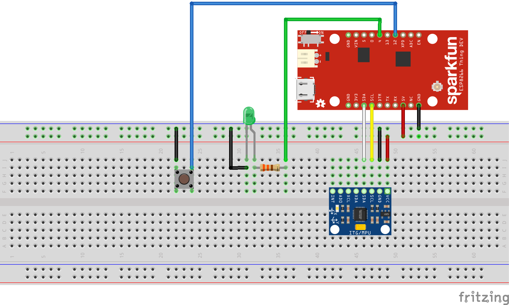
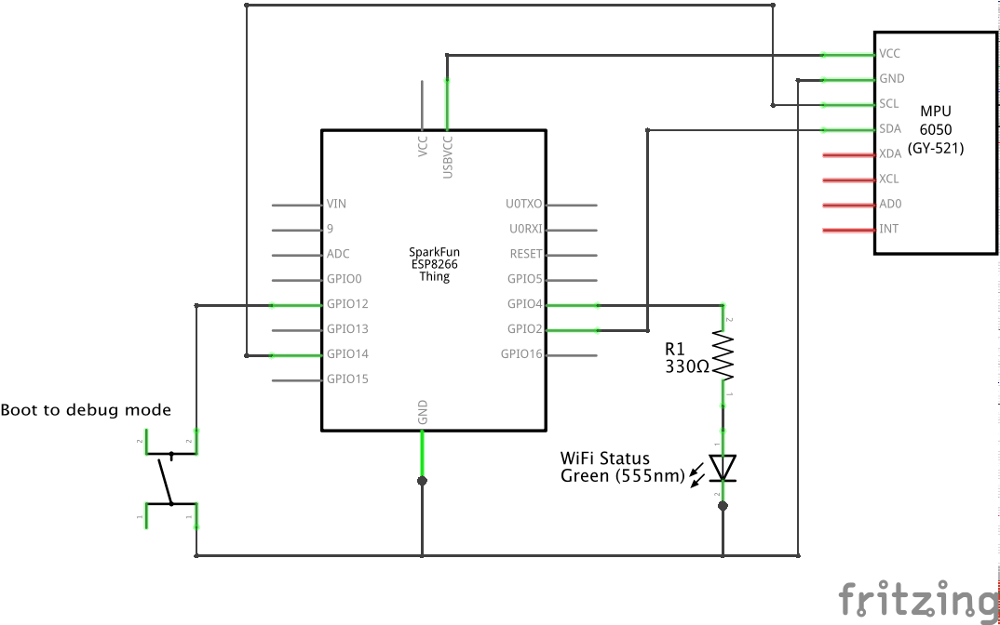

# LaundryNotification
An IoT project for SparkFun Thing Dev (ESP8266), which uses an accelerometer and Blynk to send a notification to your phone when the laundry machine is done.

### Configuration
You must provide your own Blynk auth key and WiFi SSID/password in a file called `UserSettings.h`. Use the provided [UserSettings.h.example](UserSettings.h.example) as a template.

### Debug mode
The button connected to pin `12` is used to enter debug mode. Push the button while powering on the device to activate this mode, which is indicated by alternating flashing of the builtin and WiFi LED's. 
The debug mode is configured for an extremely short laundry cycle - 3 seconds! Simply shake the device for at least three seconds, then leave it alone for another three seconds, and the device will consider the laundry cycle finished and send a Blynk notification when you're connected to WiFi.

